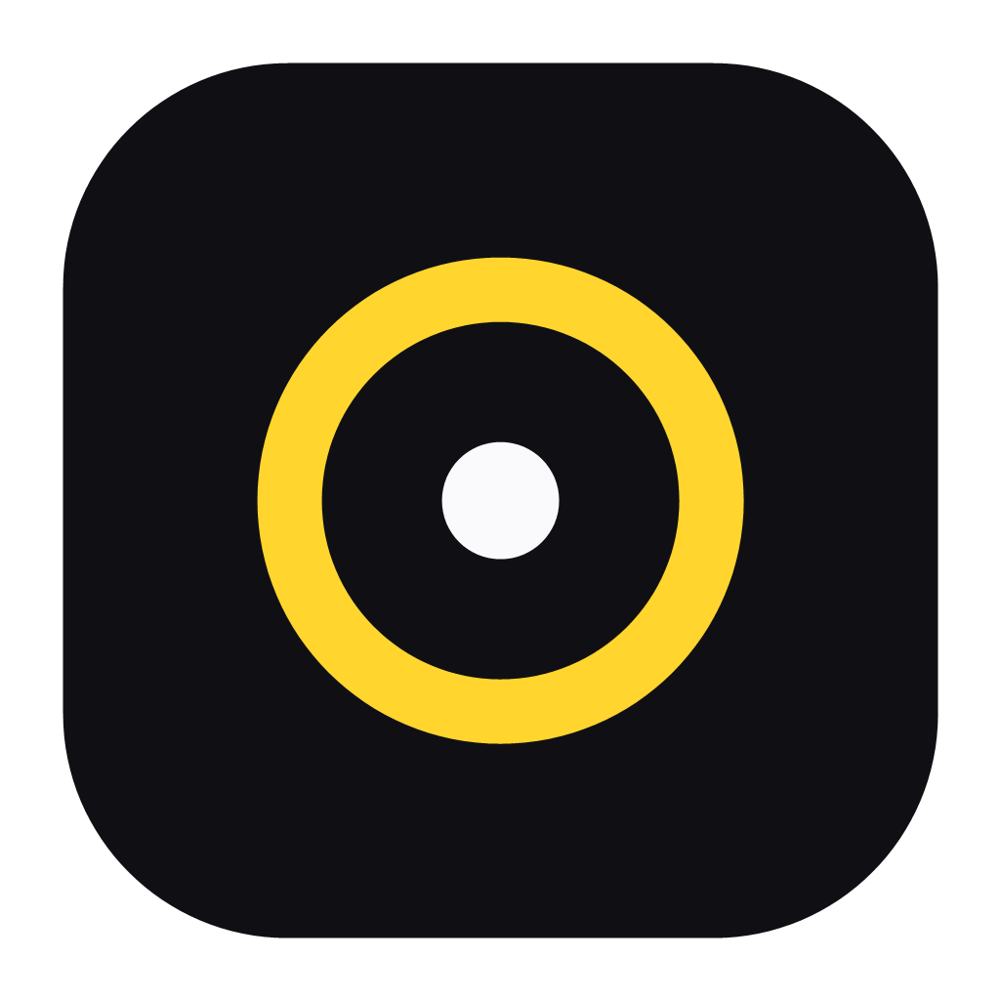
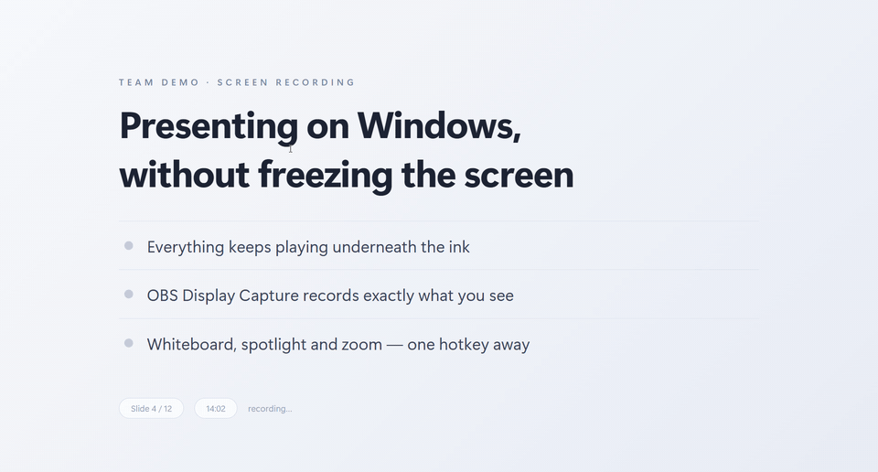
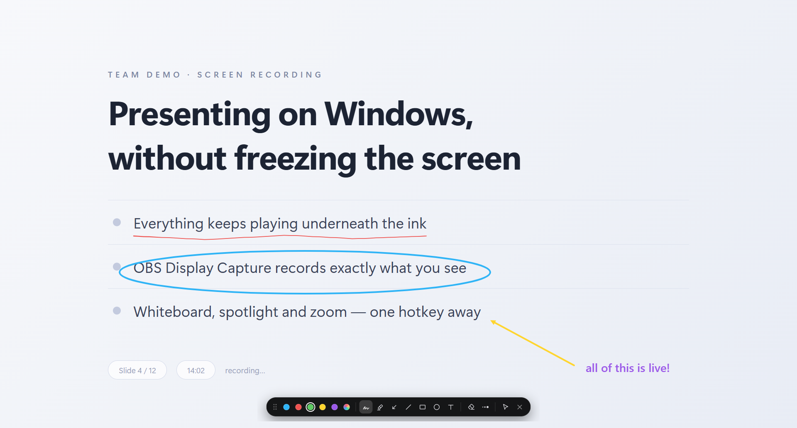
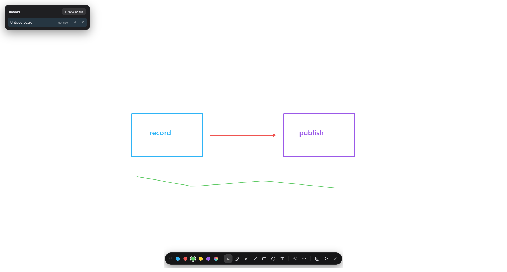
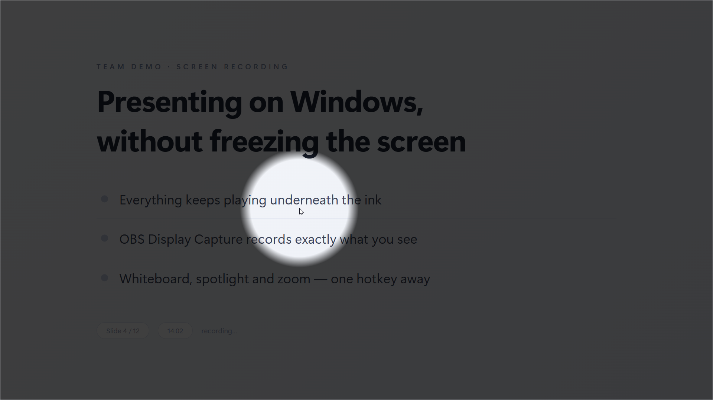
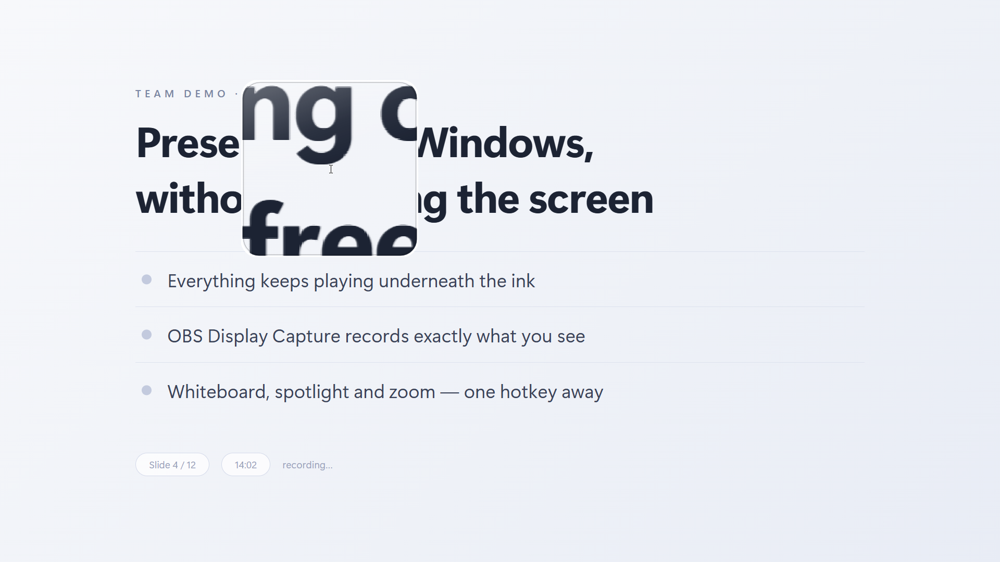
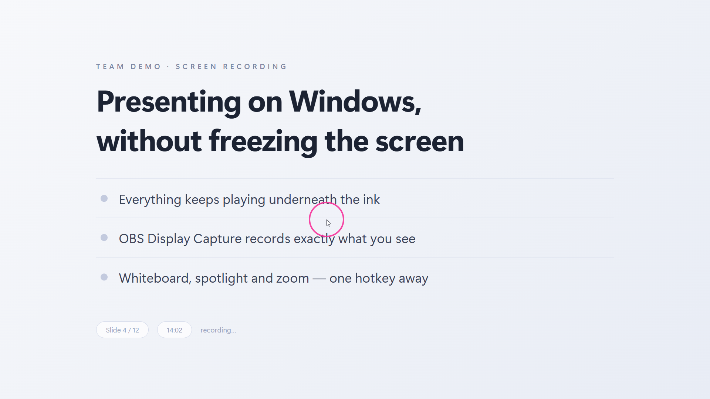

<p align="center">
  
</p>

<h1 align="center">Penlight</h1>

<p align="center">
  <b>Draw over anything — live.</b><br/>
  Presentify-style screen annotation for Windows 10/11.
</p>

<p align="center">
  <em>Free &amp; open source · local-only, no telemetry · ~1 MB installer</em>
</p>

<p align="center">
  <a href="LICENSE"></a>
  <a href="https://github.com/Ramonvdo/penlight/releases/latest"></a>
  <a href="https://github.com/Ramonvdo/penlight/actions/workflows/ci.yml"></a>
</p>

<p align="center">
  
</p>

Penlight is a lightweight tray app that lets you annotate your screen, sketch on persistent whiteboards, highlight your cursor, spotlight a region, and zoom in — all **without freezing the screen**. Webcams, videos, and live demos keep running underneath your ink, so OBS recordings look right. That's the whole reason it exists: ZoomIt's draw mode freezes the frame; Presentify doesn't exist on Windows. Penlight does both things Windows was missing.

Built with [Tauri v2](https://v2.tauri.app) (Rust + WebView2). The cursor halo, spotlight, and zoom are pure native code (Windows composition + magnification APIs) with near-zero overhead — about 32 MB of RAM in the tray.

## Features

- **Annotate** — freehand pen, highlighter, arrows, lines, rectangles, ellipses, and text over any app. 5 favorite colors plus random gradient strokes, adjustable line weight, unlimited undo/redo, optional auto-erase per stroke (hold <kbd>Ctrl</kbd> to invert), <kbd>Shift</kbd> to constrain shapes, <kbd>Alt</kbd> to fill. The pen cursor is an ink preview — a dot in your current color at your current line weight.
- **Whiteboard** — persistent boards on an infinite canvas: wheel to pan, <kbd>Ctrl</kbd>+wheel to zoom (0.1–30×), autosaved to disk, with a board library for creating, renaming, and switching boards mid-presentation (<kbd>B</kbd>).
- **Cursor highlight** — a ring, squircle, or rhombus halo around your cursor with left/right-click pulse animations. Runs on a dedicated native thread: ~0% idle CPU, composited at vsync.
- **Spotlight** — dim the whole screen except a soft circle following your cursor.
- **Zoom** — a live magnifier lens that follows your cursor (ZoomIt LiveZoom architecture). The zoomed view **shows up in OBS recordings**.
- **Interactive mode** — keep annotations on screen while you click through to apps underneath.
- Multi-monitor and mixed-DPI aware. Tray-only footprint; every feature is a global hotkey away.

<p align="center">
  
</p>

| Whiteboard | Spotlight |
|---|---|
|  |  |

| Zoom lens | Cursor halo |
|---|---|
|  |  |

## Download

Grab the latest installer from the [**Releases**](https://github.com/Ramonvdo/penlight/releases/latest) page:

| OS | Installer |
|---|---|
| **Windows 10/11 (x64)** | `Penlight_x.y.z_x64-setup.exe` |

The installer is per-user — no admin rights required.

> **SmartScreen note:** builds are not yet code-signed, so Windows may warn on
> first launch ("Windows protected your PC"). Click **More info → Run anyway**,
> verify the download against the release's `SHA256SUMS.txt`, or build from
> source below.

## Default shortcuts

All rebindable in Settings → Shortcuts.

| Action | Shortcut |
|---|---|
| Toggle annotate | `Ctrl+Alt+A` |
| Annotate without toolbar | `Ctrl+Alt+Shift+A` |
| Toggle whiteboard | `Ctrl+Alt+W` |
| Toggle cursor highlight | `Ctrl+Alt+H` |
| Toggle spotlight | `Ctrl+Alt+L` |
| Toggle zoom | `Ctrl+Alt+Z` |
| Size − / + (halo or spotlight, while active) | `Ctrl+Alt+-` / `Ctrl+Alt+=` |
| Zoom level − / + (while zoomed) | `Ctrl+Alt+,` / `Ctrl+Alt+.` |
| Exit zoom | `Esc` |

While annotating (single keys): `F` free hand · `H` highlighter · `A` arrow · `L` line · `R` rectangle · `C` circle · `T` text · `E` eraser · `1–5` favorite colors · `6` gradient · `[` `]` line weight · `W` whiteboard · `B` board library · `I` interact with apps · `Backspace` clear all · `Ctrl+Z` / `Ctrl+Shift+Z` undo/redo · `Esc` exit.

On the whiteboard: wheel pans (`Shift`+wheel horizontally), `Ctrl`+wheel zooms at the cursor, `Space`/middle-drag pans, `Ctrl+0` resets the view.

## Recording with OBS

Use **Display Capture**. Window Capture and Game Capture record a single app's surface and will not include Penlight's overlays. Everything Penlight draws — ink, halo, spotlight dim, and the zoomed lens view — is part of the composited desktop and records correctly with Display Capture.

## Known limitations

- Over **elevated (admin) windows**, click pulse animations stop (Windows blocks input hooks across integrity levels); the halo keeps following via a fallback. Nothing renders on the UAC secure desktop — that's a Windows guarantee.
- The zoom lens cannot magnify the Start menu or some system flyouts (they render unmagnified; same limitation as ZoomIt).
- While zoomed, clicks land at the *real* (unmagnified) positions — zoom is for showing, not clicking (same behavior as ZoomIt LiveZoom).
- Flicker on some Intel iGPUs: enable *Settings → General → Disable GPU compositing* and restart.

## Building from source

Prerequisites: [Node.js](https://nodejs.org) 20+, [Rust](https://rustup.rs) (stable, MSVC toolchain).

```powershell
npm install
npm run tauri dev     # run in development
npm run tauri build   # produce the NSIS installer (src-tauri/target/release/bundle/nsis)
```

Releases are built by CI: pushing a `v*` tag runs [release.yml](.github/workflows/release.yml), which attaches the installer and its SHA-256 checksums to a draft GitHub release.

## Architecture (short version)

- **Tray-only Tauri app**; all windows created from Rust. Rust owns all mode state.
- **Annotation/whiteboard**: one transparent, click-through-toggleable WebView2 overlay per monitor (physical-pixel sized, height−1px to dodge Windows' fullscreen heuristics). Stroke engine is a display list rendered to two stacked canvases, smoothed with [perfect-freehand](https://github.com/steveruizok/perfect-freehand).
- **Halo + spotlight**: a native thread owning a `WS_EX_NOREDIRECTIONBITMAP` composition window spanning the virtual screen; visuals move via `Visual.Offset` at vsync. Input via `WH_MOUSE_LL` with a constant-time callback and a `GetCursorPos` watchdog.
- **Zoom**: a `WC_MAGNIFIER` lens window on a 20 ms tick (the fullscreen Magnification API is deliberately avoided — it's invisible to screen capture).

## Contributing, security, license

- [CONTRIBUTING.md](CONTRIBUTING.md) — dev setup, project map, conventions.
- [SECURITY.md](SECURITY.md) — how to report vulnerabilities, and what Penlight does (and deliberately doesn't do) with your data.
- [CHANGELOG.md](CHANGELOG.md) — what's new in each release.
- [MIT](LICENSE) © 2026 Penlight contributors.
